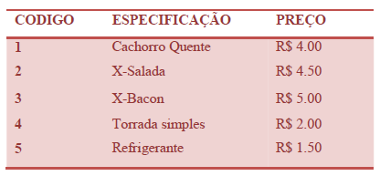

# 1038 - Lanche

Com base na tabela abaixo, escreva um programa que leia o código de um item e a quantidade deste item. A seguir, calcule e mostre o valor da conta a pagar.



[Lanche - Beecrowd](https://www.beecrowd.com.br/judge/pt/problems/view/1038)

# Solução 
```
#include <iostream>
#include <iomanip>
#include <map>
using namespace std;


int main() {
    int cod, qntd;
    cin >> cod >> qntd;

    map<int, double> lanches = {
        {1, 4.00}, // Cachorro-quente
        {2, 4.50}, // X-salada
        {3, 5.00}, // X-bacon
        {4, 2.00}, // Torrada Simples
        {5, 1.50} // Refrigerante
    };

    double total = lanches[cod] * qntd;
    cout << "Total: R$ " << fixed << setprecision(2) << total << endl;

    return 0;
}
```

