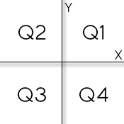

# 1041 - Coordenadas de um Ponto

Leia 2 valores com uma casa decimal (x e y), que devem representar as coordenadas de um ponto em um plano. A seguir, determine qual o quadrante ao qual pertence o ponto, ou se está sobre um dos eixos cartesianos ou na origem (x = y = 0).



Se o ponto estiver na origem, escreva a mensagem “Origem”.

Se o ponto estiver sobre um dos eixos escreva “Eixo X” ou “Eixo Y”, conforme for a situação.

[Coordenadas de um Ponto - Beecrowd](https://www.beecrowd.com.br/judge/pt/problems/view/1041)

# Solução 
```

```