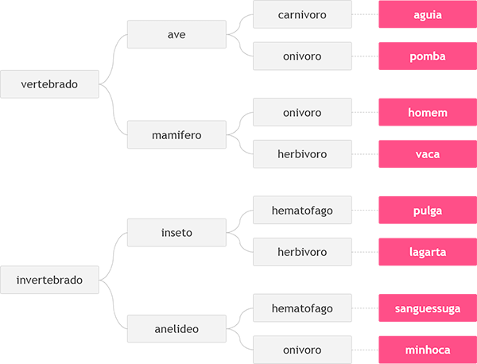

# 1049 - Animal

Neste problema, você deverá ler 3 palavras que definem o tipo de animal possível segundo o esquema abaixo, da esquerda para a direita.  Em seguida conclua qual dos animais seguintes foi escolhido, através das três palavras fornecidas.



[Animal - Beecrowd](https://www.beecrowd.com.br/judge/pt/problems/view/1049)

# Solução 

```
#include <iostream>
#include <string>
using namespace std;

string classifyAnimal(const string& type1, const string& type2, const string& type3) {
    if (type1 == "vertebrado")
        if (type2 == "ave")
            return (type3 == "carnivoro") ? "aguia" : "pomba";
        else // mamifero
            return (type3 == "onivoro") ? "homem" : "vaca";
    else // invertebrado
        if (type2 == "inseto")
            return (type3 == "hematofago") ? "pulga" : "lagarta";
        else  // anelideo
            return (type3 == "hematofago") ? "sanguessuga" : "minhoca";
}

int main() {
    string type1, type2, type3;
    getline(cin, type1);
    getline(cin, type2);
    getline(cin, type3);

    cout << classifyAnimal(type1, type2, type3) << endl;
    return 0;
}
```