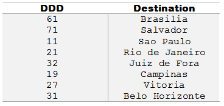

# 1050 - DDD

Leia um número inteiro que representa um código de DDD para discagem interurbana. Em seguida, informe à qual cidade o DDD pertence, considerando a tabela abaixo:



Se a entrada for qualquer outro DDD que não esteja presente na tabela acima, o programa deverá informar:
DDD nao cadastrado

[DDD - Beecrowd](https://www.beecrowd.com.br/judge/pt/problems/view/1050)

# Solução

```
#include <iostream>
#include <map>
using namespace std;

int main(){

    map<int, string> dddMap = {
        {61, "Brasilia"},
        {71, "Salvador"},
        {11, "Sao Paulo"},
        {21, "Rio de Janeiro"},
        {32, "Juiz de Fora"},
        {19, "Campinas"},
        {27, "Vitoria"},
        {31, "Belo Horizonte"}
    };

    int ddd;
    cin >> ddd;

    auto it = dddMap.find(ddd);

    if(it != dddMap.end())
        cout << it->second << endl;
    else
        cout << "DDD nao cadastrado" << endl;

    return 0;
}
```