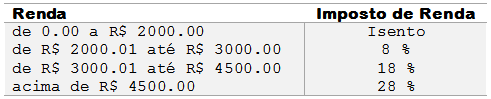

# 1051 - Imposto de Renda

Em um país imaginário denominado Lisarb, todos os habitantes ficam felizes em pagar seus impostos, pois sabem que nele não existem políticos corruptos e os recursos arrecadados são utilizados em benefício da população, sem qualquer desvio. A moeda deste país é o Rombus, cujo símbolo é o R$.

Leia um valor com duas casas decimais, equivalente ao salário de uma pessoa de Lisarb. Em seguida, calcule e mostre o valor que esta pessoa deve pagar de Imposto de Renda, segundo a tabela abaixo.



Lembre que, se o salário for R$ 3002.00, a taxa que incide é de 8% apenas sobre R$ 1000.00, pois a faixa de salário que fica de R$ 0.00 até R$ 2000.00 é isenta de Imposto de Renda. No exemplo fornecido (abaixo), a taxa é de 8% sobre R$ 1000.00 + 18% sobre R$ 2.00, o que resulta em R$ 80.36 no total. O valor deve ser impresso com duas casas decimais.

[Imposto de Renda - Beecrowd](https://www.beecrowd.com.br/judge/pt/problems/view/1051)

# Solução

```
#include <iostream>
#include <iomanip>
using namespace std;

int main(){

    double salario, imposto = 0;
    cin >> salario;

    if(salario > 4500){
        imposto += (salario - 4500) * 0.28;
        salario = 4500;
    }
    if(salario > 3000){
        imposto += (salario - 3000) * 0.18;
        salario = 3000;
    }
    if(salario > 2000)
        imposto += (salario - 2000) * 0.08;

    if(imposto == 0)
        cout << "Isento" << endl;
    else
        cout << fixed << setprecision(2) << "R$ " << imposto << endl;

    return 0;
}
```