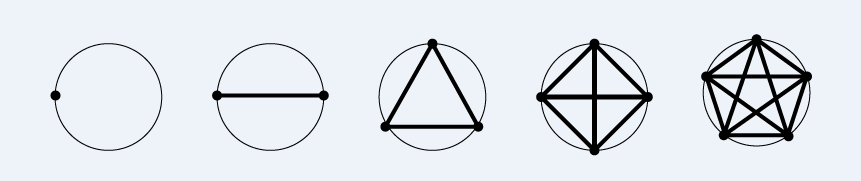

# 2802 - Dividindo Círculos


Dado um conjunto de N pontos sobre uma circunferência de um círculo, todo par de pontos está ligado por um segmento e três desses segmentos nunca se encontram em um ponto interno à circunferência.

Sua tarefa é determinar em quantas partes esses segmentos dividem o interior do círculo.

[Dividindo Círculos - Beecrowd](https://www.beecrowd.com.br/judge/pt/problems/view/2802)

# Solução

```
#include <bits/stdc++.h>
#include <iomanip>
#define ll long long

using namespace std;

int main() { 
    ios_base::sync_with_stdio(false);
    cin.tie(0);
    
	ll x;
	cin >> x;
	cout << 1 + ((x * (x-1)) / 2) + ((x * (x-1) * (x-2) * (x-3)) /24) << endl; // Fórmula de Segno - Número de regiões planas definidas por n pontos em um círculo
}
```