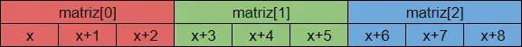
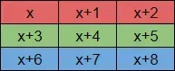

# Sumário

- O que é uma matriz?
- Matrizes em C
- Representação na memória
- Representação didática
- Como acessar os elementos de uma matriz?
- Aritmética de ponteiros em matrizes
- Como alterar os elementos de uma matriz?

# O que é uma matriz?

Matrizes armazenam um conjunto de vetores. Ou seja, uma matriz é um vetor de vetores.

Em C, as matrizes são homogêneas. Isto é, os vetores armazenados por uma matriz são todos do mesmo tipo.

Enquanto um vetor tem um conjunto de elementos que podem ser acessados pelo índice, uma matriz tem um conjunto de vetores que podem ser acessados pelo índice.

# Matrizes em C

A declaração de uma matriz em C segue o template abaixo:
```
<tipo> <nome>[<vetores>][<tamanho>];
```

```/*
    tipo -> int (armazena inteiros)
    nome -> matriz
    vetores -> 3 (armazena tres vetores)
    tamanho -> 3 (cada vetor armazena tres elementos)
*/

int matriz[3][3];
```

Perceba que, como nossa matriz contém três vetores de três elementos cada, então ela armazena nove elementos ao todo.

- Observações:

    - As matrizes em C têm o mesmo tamanho desde sua declaração até o final do programa.

    - Podemos utilizar o comando sizeof para saber o número de bytes de uma matriz. Caso queiramos saber quantos vetores ela tem, basta dividir o tamanho em bytes da matriz pelo tamanho em bytes de um vetor armazenado por ela. Analogamente, basta dividir o tamanho em bytes da matriz pelo tamanho em bytes do seu tipo para descobrir quantos elementos ela tem de fato:

```
#include <stdio.h>

int main(){
    int m[5][5];

    printf("Tamanho em bytes de um inteiro -> %d\n", sizeof(int));
    printf("Tamanho em bytes do vetor m[0] -> %d\n", sizeof(m[0]));
    printf("Tamanho em bytes da matriz m -> %d\n", sizeof(m));
    printf("Quantidade de vetores da matriz m -> %d\n", sizeof(m)/sizeof(m[0]));
    printf("Quantidade de elementos da matriz m -> %d\n", sizeof(m)/sizeof(int));
}
/* Saída:
Tamanho em bytes de um inteiro -> 4
Tamanho em bytes do vetor m[0] -> 20
Tamanho em bytes da matriz m -> 100
Quantidade de vetores da matriz m -> 5
Quantidade de elementos da matriz m -> 25

*/
```

# Representação na memória

Ao declarar uma matriz, o computador irá reservar um conjunto de posições sequenciais de memória.

Isto significa que, para o exemplo int matriz[3][3], o computador reservou espaço para armazenar três vetores, cada um capaz de armazenar três inteiro.



Sendo o endereço de memória do primeiro elemento da nossa matriz, então o primeiro vetor armazenado por ela, o vetor matriz[0], ocupa as posições , e .

Observação: a aritmética de ponteiros foi considerada para o cálculo acima.

# Representação didática
Para fins didáticos, normalmente uma matriz é apresentada em forma de tabela, na qual cada linha representa um vetor.

Observe como seria a representação didática da matriz utilizada no exemplo acima:



# Aritmética de ponteiros em matrizes

O nome de uma matriz é tratado como um ponteiro para o primeiro vetor armazenado por ela. Ao “apontar” para um vetor, este ponteiro está “apontando” para outro ponteiro, visto que um vetor “aponta” para o primeiro elemento de um conjunto sequencial de elementos.

Tendo isso em vista, precisamos utilizar dois asteriscos para poder acessar um determinado elemento: um irá fornecer o vetor e o outro irá acessar o elemento.

Para facilitar, vamos começar utilizando apenas um asterisco: o comando irá acessar o vetor , mas não os seus elementos. Ou seja, esse comando serve como o nome do vetor.

Agora imagine que seja o vetor . Para acessarmos os elementos desse vetor, devemos recorrer à aritmética de ponteiros vista na última aula. Dessa forma, o comando irá acessar o elemento do vetor .

Para finalizar, basta substituir por . Com isso, sabemos que o comando acessa o elemento do vetor da matriz .

Perceba que equivale a , pois ambos acessam o vetor , e que equivale a , pois ambos acessam o elemento do vetor .

Observe que os parênteses são necessários para que as somas sejam realizadas antes operador de acesso . Caso não houvesse soma, isto é, ou , os parênteses não seriam necessários.

- Exemplos para a matriz int m[2][3] :

    - -> acessa o primeiro vetor, isto é, armazena um ponteiro para a primeira posição do primeiro vetor

    - -> acessa o primeiro elemento do primeiro vetor

    - -> acessa o segundo elemento do primeiro vetor

    - -> acessa o segundo elemento do segundo vetor

    - -> acessa o terceiro elemento do segundo vetor

Observação: como o conjunto de posições da matriz é sequencial, podemos acessar todos os elementos da matriz acima partindo da primeira posição do primeiro vetor, ou , e somando os valores de (primeiro elemento) a (último elemento).

# Como acessar os elementos de uma matriz?

Para acessar cada posição da matriz, podemos utilizar tanto a aritmética de ponteiros apresentada acima quanto o operador [ ][ ], indicando primeiro o índice do vetor que contém o elemento, e depois o índice do elemento dentro do respectivo vetor.

Para facilitar o entendimento, podemos utilizar a representação didática para visualizar melhor os índices de cada elemento.

Como exemplo, vamos analisar o acesso aos elementos da matriz m[4][4] :


# Como alterar os elementos de uma matriz?

Podemos utilizar os mesmos métodos utilizados com vetores para atribuir, alterar e ler os elementos de uma matriz. Observe:

```
#include <stdio.h>

int main(){
    // declarar e alterar todos os elementos
    int m[2][3] = {{1, 2, 3}, {4, 5, 6}};

        /* Observação:
            A declaração: int m[2][3] = {1, 2, 3, 4, 5, 6}; também seria válida,
        pois o compilador já separaria os elementos em vetores nos tamanhos adequados,
        preenchendo com 0's o que faltasse no final.
        */

    // atribuir utilizando colchetes
    m[0][0] = 123;

    // atribuir utilizando aritmética de ponteiros
    *(*(m+1)+2) = 789;

    // ler utilizando colchetes
    scanf("%d", &m[0][2]);

    // ler utilizando aritmética de ponteiros
    scanf("%d", *(m+1)+1);

        /* Observação:
            Perceba que utilizamos apenas um asterisco, pois não queremos acessar
        acessar o elemento, mas pegar seu endereço
        */

    for(int linha=0;linha<2;linha++){
        for(int coluna=0;coluna<3;coluna++){
            printf("%d ", m[linha][coluna]);
        }
        printf("\n");
    }
}
/* Saída para uma entrada com os números 13 e 21:
123 2 13
4 21 789

*/
```

Observações:

É possível omitir o número de vetores na declaração de uma matriz, se os elementos forem declarados junto com a declaração. Dessa forma, o compilador irá determinar o número de vetores dividindo a quantidade de elementos declarada pela quantidade de elementos que cada vetor deverá ter. Caso essa divisão tenha resto, então o número de vetores será aumentado em uma unidade e os elementos faltantes serão preenchidos com :

```#include <stdio.h>

int main(){
    int x[][3] = {1, 2, 3, 4};
    
    // como são 4 elementos, e cada vetor deve ter 3, então há 2 vetores no total
    
    // os 2 últimos elementos do segundo vetor foram preenchidos com 0
    
    for(int linha=0;linha<2;linha++){
        for(int coluna=0;coluna<3;coluna++){
            printf("%d ", x[linha][coluna]);
        }
        printf("\n");
    }
}
/* Saída:
1 2 3
4 0 0

*/
```

Também é possível declarar uma matriz inteiramente preenchida com zeros(os dois tamanhos devem ser declarados) utilizando o mesmo método dos vetores: int x[4][3] = { };.