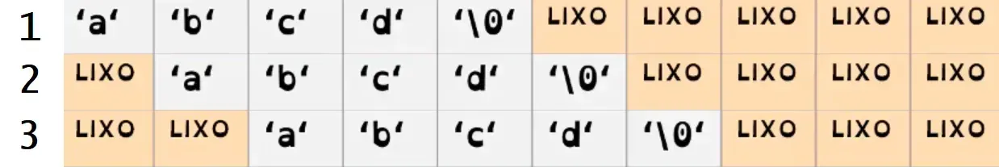
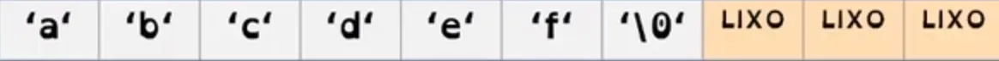

# Sumário

- O que é uma string?
- Leitura de uma string.
- Escritura de uma string.
- Codificação: leitura, escrita e erros comuns.

# O que é?
Strings são utilizadas para armazenar uma cadeia de caracteres.

Em C, para armazenar uma string, temos que utilizar um vetor de caracteres. Na aula de caracteres vemos que o tipo char guarda um caractere, e uma string seria uma cadeia de caracteres. Então, se queremos guardar vários caracteres, estamos utilizando um vetor de caracteres.

Por exemplo, para criar vetor de 15 caracteres, no qual podemos armazenar uma string, fazemos:

```
char nome[15];
```

# Leitura
Para fazer a leitura de uma string devemos nos atentar ao seguinte:

Para ler uma string do usuário, utilizamos %s no scanf.
Você deve fornecer a posição de memória que vai começar a armazenar a string do usuário.
O nome de um vetor retorna a posição da sua primeira posição de memória. Então, para armazenar uma string a partir da primeira posição do vetor, devemos escrever o próprio nome do vetor.
Por exemplo, imagine que você tem a variável "char nome[10]" e o usuário vai digitar "abcd". Podemos alocar a string das seguintes maneiras:

```
scanf("%s", nome); 
scanf("%s", nome+1);
scanf("%s", nome+2);
```

Observe que no primeiro caso, ao se passar "nome", estamos dizendo para começar a armazenar a string a partir da posição de memória do começo do vetor, colocando todos os caracteres sucessivamente no vetor. Nos outros dois exemplos, vemos que se quisermos começar a armazenar a partir de outra posição, adicionamos algum número à primeira posição de memória para indicarmos as posições seguintes. A Figura 1 mostra como cada uma das linhas do codigo acima armazenaria os valores no vetor de char nome.



- Figura 1 : Exemplos de strings sendo armazenada na memória

O caractere especial '\0' sempre é adicionado ao fim da string lida e indica o fim da string.

# Escrita
Para escrevermos uma string, também utilizamos o %s, e, diferentemente de todos os outros tipos que vimos, devemos fornecer uma posição de memória para o printf.

A string que será impressa será composta pelo caracteres entre a posição de memória fornecida e o próximo '\0' encontrado.

Por exemplo, imagine que você tem a variável "char nome[10]" e o usuário vai digitar "abcdef" e essa leitura foi realizada com um scanf("%s", nome).



- Figura 2 : Palavra abcdef sendo armazenada em um vetor de char com 10 posições

Vamos observar algumas formas de imprimir a string na tela.

```
printf("%s", nome); //abcdef
printf("%s", nome+1); // bcdef
printf("%s", nome+2); // cdef
```

Perceba que no primeiro caso, pedimos que ele comece a partir da primeira posição de memória, então ele percorrerá todo o vetor imprimindo os caracteres até encontrar o caractere '\0', que indica o fim da string

Nos outros exemplos vemos que, assim como na leitura, se quisermos começar a imprimir a partir de alguma outra posição, passamos como referência a primeira posição de memória e adicionamos a partir de quantas posições depois queremos começar a imprimir.

# Erros comuns

- Não é possível comparar strings como variáveis normais.

```
int main(){
    char n1[10], n2[10];
    scanf("%s %s", n1, n2);

    if(n1 == n2){
        printf("Igual\n");
    }else{
        printf("Diferentes\n");
    }
```

O código acima está aparentemente correto, mas ao testarmos alguns casos nele, vemos que ele sempre resulta em "Diferentes". Isso acontece pois não estamos comparando os valores das strings, mas sim posições de memória, e como as duas strings estão alocadas em posições de memória diferentes, o programa sempre irá imprimir "Diferentes". Para comparar strings, precisamos de comandos específicos, que aprenderemos na próxima aula.

- Não se pode fazer atribuições de strings como variáveis normais. Veja o código abaixo:
```
int main(){
    char n1[10], n2[10];
    scanf("%s", n1);
    n2 = n1;
    printf("%s %s", n1, n2);
```

Mais uma vez, o código parece aparentemente certo, mas ao tentar compilá-lo receberemos um erro, pois estamos tentando trocar a posição de memória inicial do vetor n2 para ser igual à de n1, mas não podemos alterar a posição em que um vetor estático está.

- Não podemos ler nomes com espaço utilizando o scanf normalmente. Por exemplo:

```
int main(){
    char n1[10], n2[10];
    scanf("%s", n1);
    printf("%s", n1);
```

Se tentarmos digitar "Neps Academy", percebemos que o programa irá imprimir apenas "Neps", pois o scanf lê até um espaço ou uma quebra de linha ('\n'). Para lermos toda uma linha, precisamos utilizar funções específicas.